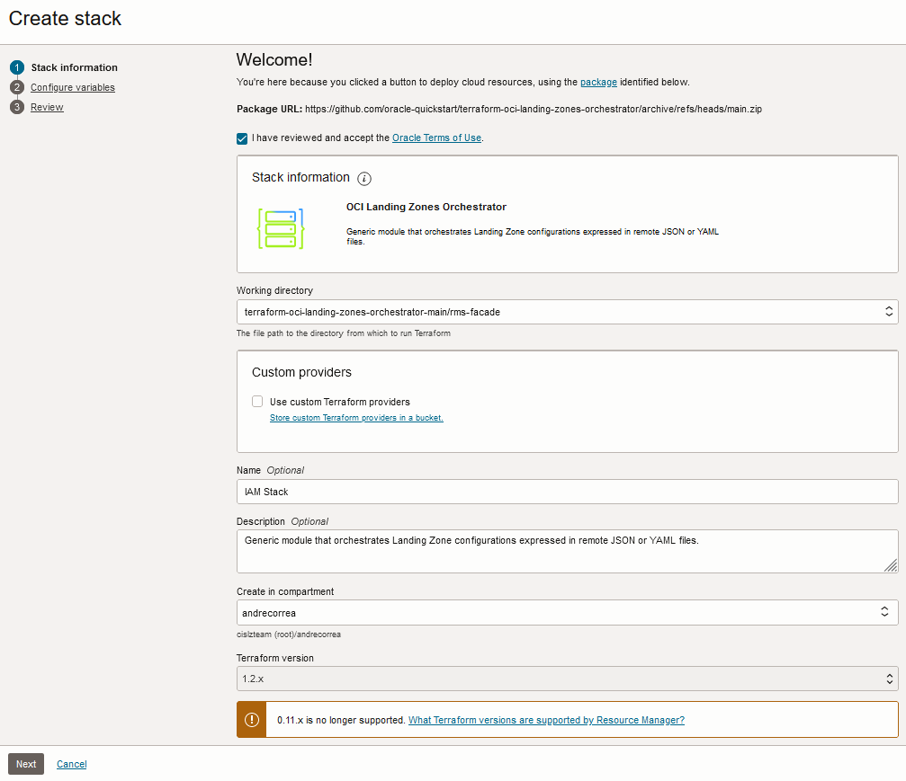
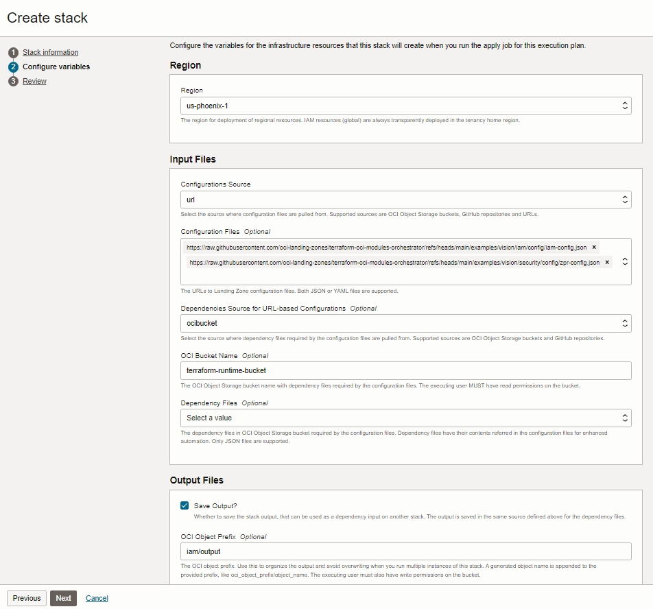
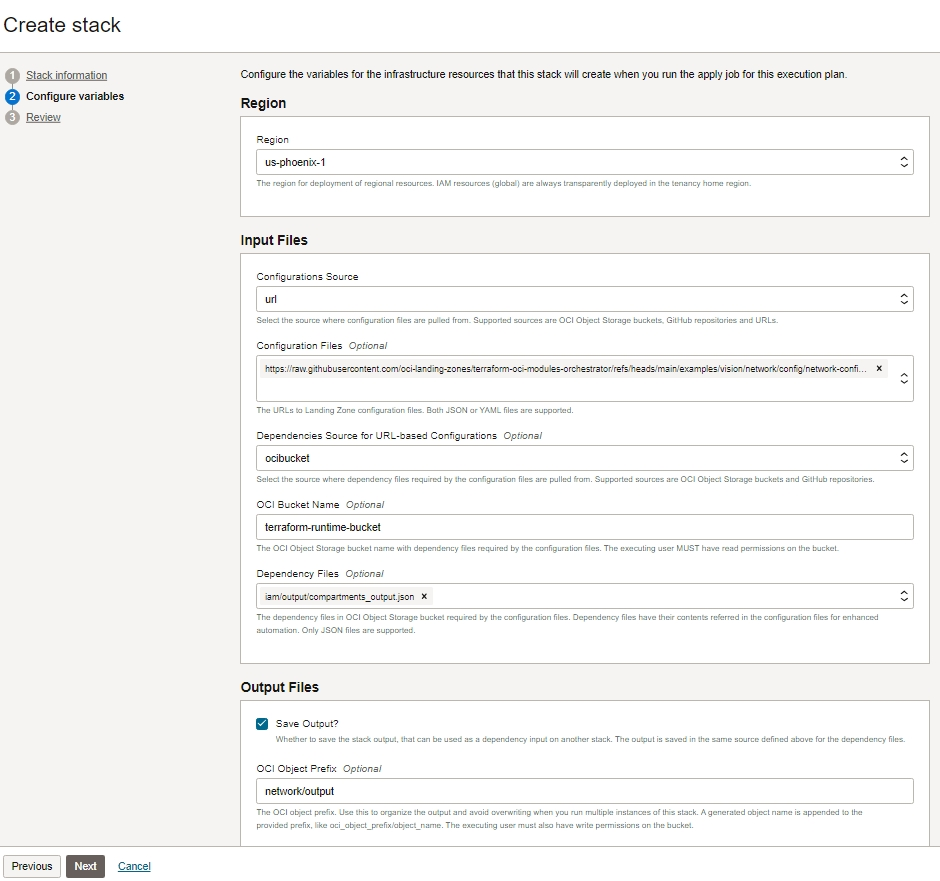
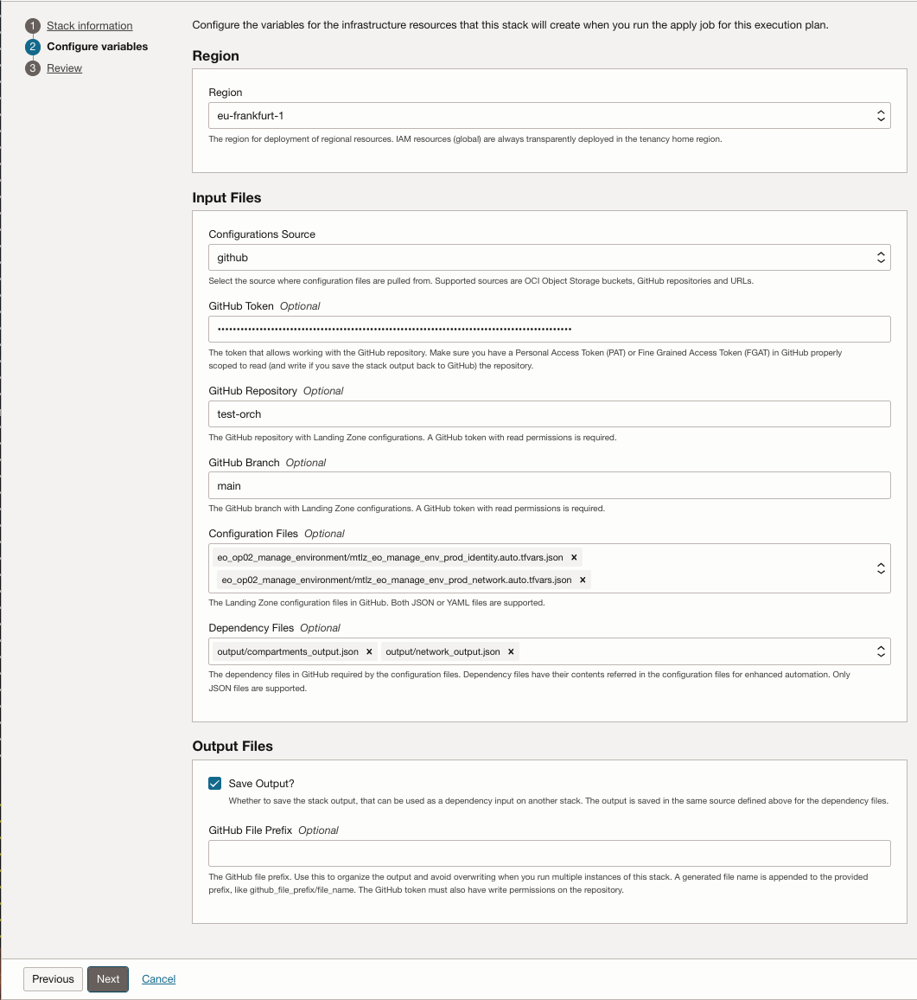

# OCI Landing Zones Orchestrator


[](https://cloud.oracle.com/resourcemanager/stacks/create?zipUrl=https://github.com/oci-landing-zones/terraform-oci-modules-orchestrator/archive/refs/heads/main.zip)<br>
*If you are logged into your OCI tenancy in the Commercial Realm (OC1), the button will take you directly to OCI Resource Manager where you can proceed to deploy. If you are not logged, the button takes you to Oracle Cloud initial page where you must enter your tenancy name and login to OCI.*
<br>

## Introduction

Welcome to the [OCI Landing Zones (OLZ) Community](https://github.com/oci-landing-zones)! OCI Landing Zones simplify onboarding and running on OCI by providing design guidance, best practices, and pre-configured Terraform deployment templates for various architectures and use cases. These enable customers to easily provision a secure tenancy foundation in the cloud along with all required services, and reliably scale as workloads expand.

The OCI Landing Zones Orchestrator is a generic Terraform module that orchestrates the creation of Landing Zone architectures expressed in a single or multiple configuration files, that can be JSON documents, YAML documents or contain HCL (Hashicorp Language) object declarations. These configurations **must** be defined according to the specifications and requirements set forth by the OCI Landing Zones core modules, that are available in the repositories listed in table below. The table also shows the respective repository versions referenced by this Orchestrator release.

### <a name="mod_versions">Modules Versions</a>

Repository | Referenced Tags/Branches
-----------|--------------------
[Identity & Access Management](https://github.com/oracle-quickstart/terraform-oci-cis-landing-zone-iam) | [v0.2.9 tag](https://github.com/oracle-quickstart/terraform-oci-cis-landing-zone-iam/releases/tag/v0.2.9)
[Networking](https://github.com/oci-landing-zones/terraform-oci-modules-networking) | [v0.7.5 tag](https://github.com/oci-landing-zones/terraform-oci-modules-networking/releases/tag/v0.7.5)
[Governance](https://github.com/oci-landing-zones/terraform-oci-modules-governance) | [v0.1.5 tag](https://github.com/oci-landing-zones/terraform-oci-modules-governance/releases/tag/v0.1.5)
[Security](https://github.com/oci-landing-zones/terraform-oci-modules-security) | [v0.2.0 tag](https://github.com/oci-landing-zones/terraform-oci-modules-security/releases/tag/v0.2.0)
[Observability & Monitoring](https://github.com/oci-landing-zones/terraform-oci-modules-observability) | [v0.2.3 tag](https://github.com/oci-landing-zones/terraform-oci-modules-observability/releases/tag/v0.2.3)
[Secure Workloads](https://github.com/oci-landing-zones/terraform-oci-modules-workloads) | [v0.2.0 tag](https://github.com/oci-landing-zones/terraform-oci-modules-workloads/releases/tag/v0.2.0)

Such approach allows for the build out of custom Landing Zones in a declarative fashion, without any Terraform coding knowledge.

**Note:** users of the [legacy Orchestrator](https://github.com/oracle-quickstart/terraform-oci-open-lz/tree/master/orchestrator) please check [UPGRADE.md](./UPGRADE.md) for upgrading your stack to this new Orchestrator version.

## Requirements

## Terraform Version >= 1.3.0

This module requires Terraform binary version 1.3.0 or greater, as it relies on Optional Object Type Attributes feature. The feature shortens the amount of input values in complex object types, by having Terraform automatically inserting a default value for any missing optional attributes.

### IAM Permissions

The permissions to execute the Orchestrator are determined by the configurations that are given as inputs. Therefore each Orchestrator instance may require different IAM policies. Refer to the policy requirements of each module that backs up the provided configurations. For example, if the configurations contains *compartments_configuration* and *network_configuration*, the Orchestrator instance requires the permissions required by [Compartments](https://github.com/oracle-quickstart/terraform-oci-cis-landing-zone-iam/compartments) and [Networking](https://github.com/oci-landing-zones/terraform-oci-modules-networking) modules.

## External Dependencies

Landing Zones can be expressed in a single configuration or split in multiple separate configurations potentially managed by different teams. Separate configurations require the usage of the output of one configuration as the input of another. The classic example is consuming compartments in other configurations, like networking. Other examples are consuming networking resources in Compute instances, or consuming encryption keys in Block volumes. There are many other dependencies examples.

To account for these scenarios, the Orchestrator can generate and intake dependency files. The required dependencies for a given Orchestrator instance depends on what is expressed in its input configurations. For example, if you refer to a compartment key (instead of an OCID) in the *compartment_id* attribute of *network_configuration*, the *compartments_dependency* variable is required. If you refer to a subnet key (instead of an OCID) in the *subnet_id* attribute of *instances_configuration*, the *network_dependency* variable is required. Each underlying module specifies its supported dependencies, and the Orchestrator figures out the dependency files to generate for further consumption by other Orchestrator instances.

Below are the output file names that are generated for the respective configuration that can be used as a dependency:

Configuration | Output File Name
--------------|------------------
compartments_configuration | compartments_output.json
network_configuration | network_output.json
nlb_configuration | nlbs_output.json
notifications_configuration | topics_output.json
streams_configuration | streams.output.json
logging_configuration | service_logs_output.json and custom_logs_output.json
vaults_configuration | vaults_output.json and keys_output.json
tags_configuration | tags_output.json
instances_configuration | instances_output.json

## How to Invoke the Orchestrator

Before anything, have your configurations (and dependencies, if any) ready and accessible. This repository has sample configurations in [*./examples/vision/iam/config*](./examples/vision/iam/config), [*./examples/vision/security/config*](./examples/vision/security/config) and [*./examples/vision/network/config*](./examples/vision/network/config) folders. 

An extensive catalog of configurations is available in the [Operating Entities Landing Zones repository](https://github.com/oracle-quickstart/terraform-oci-open-lz/tree/master/examples).

Next we present a practical scenario using both RMS and Terraform CLI where configurations for IAM (Identity and Access Management), ZPR (Zero Trust Packet Routing) and networking are deployed via the Orchestrator. IAM and ZPR are deployed together, while networking is deployed separately in its own configuration.

### Deploying with OCI Resource Manager Service (RMS)

The Orchestrator provides an [RMS Facade](./rms-facade/) module allowing for the usage of configuration files stored in private GitHub repositories, private OCI buckets or plain URLs. Dependencies can also be consumed from GitHub repositories and OCI buckets.

The table below summarizes the supported combinations of configurations and dependencies sources:

Configurations Source         | Configuration Files Formats | Dependencies Sources                          | Dependency Files Formats | Requirements 
------------------------------|-----------------------------| ----------------------------------------------|------------------------- | ------------ 
Private GitHub repository     | JSON, YAML                  | Same private GitHub repository                | JSON                     | GitHub token with read/(write, if saving output) access permissions on the private GitHub repository. 
Private OCI bucket            | JSON, YAML                  | Same private OCI bucket                       | JSON                     | OCI IAM permissions to read/(write, if saving output) to the private OCI bucket. 
Plain Public URLs             | JSON, YAML                  | Private GitHub repository, private OCI bucket | JSON                     | URLs are reachable. Read/(write, if saving output) access permissions to private GitHub repository or private OCI bucket

**FOR RUNNING THIS EXAMPLE AS-IS, A PRE-EXISTING PRIVATE BUCKET NAMED "terraform-runtime-bucket" IS REQUIRED.**

#### IAM/ZPR Stack

Steps 1-9 below show how to deploy IAM and ZPR configurations. The stack is one concrete Orchestrator example with all variables pre-filled, and it can be changed depending on where your configuration files are located and which system (GitHub or OCI bucket) you want to utilize for dependencies. 

1. Click [](https://cloud.oracle.com/resourcemanager/stacks/create?zipUrl=https://github.com/oci-landing-zones/terraform-oci-modules-orchestrator/archive/refs/heads/main.zip&zipUrlVariables={"input_config_files_urls":"https://raw.githubusercontent.com/oci-landing-zones/terraform-oci-modules-orchestrator/refs/heads/main/examples/vision/iam/config/iam-config.json,https://raw.githubusercontent.com/oci-landing-zones/terraform-oci-modules-orchestrator/refs/heads/main/examples/vision/security/config/zpr-config.json","url_dependency_source_oci_bucket":"terraform-runtime-bucket","url_dependency_source":"ocibucket","save_output":true,"oci_object_prefix":"iam/output"})
2. Accept terms, wait for the configuration to load. 
3. Set *Working directory* to "terraform-oci-landing-zones-orchestrator-main/rms-facade". 
4. Give the stack a name in the *Name* field.
5. Make sure *Terraform version* is set to 1.5.x or greater. Click *Next* button at the bottom of the screen. 

The [screenshot below](#rms-stack-creation) shows how the RMS stack creation screen looks like on step 5.

<a name="rms-stack-creation"></a>

6. Upon clicking *Next* button, the *Configure variables* screen is displayed with input variables pre-filled: (see [image below](#iamzpr-stack-input-variables) for an example):
    1. Select or accept the selected deployment *Region* (IAM resources are always automatically deployed in the home region regardless).
    2. In *Input Files* section, select the *Configurations Source*. Each supported source has distinct input fields, but all of them have *Configuration Files* (Required) and *Dependency Files* (Optional). The example has the following fields:
        - *Configurations Source*: "url", which means any URL in the *Configuration Files* field must be publicly available.
        - *Configuration Files*: *https://raw.githubusercontent.com/oci-landing-zones/terraform-oci-modules-orchestrator/refs/heads/main/examples/vision/iam/config/iam-config.json* and *https://raw.githubusercontent.com/oci-landing-zones/terraform-oci-modules-orchestrator/refs/heads/main/examples/vision/security/config/zpr-config.json*, both available in this public GitHub repository.
        - *Dependencies Source for URL-based Configurations*: "ocibucket", which means dependency files are read and written to an OCI private bucket.
        - *OCI Bucket Name*: "terraform-runtime-bucket", the bucket name where dependency files are read and written to. **THE BUCKET IS NOT CREATED BY THE ORCHESTRATOR.**
        - *Dependency Files*: empty, which means the specified configuration files stack do not rely on any dependencies.
    3. In *Output Files* section, the following fields are pre-filled:
        - *Save Output?* option is checked, which means the stack output is saved in the same OCI bucket specified for dependency files. The saved file can be subsequently referred as a dependency in *Dependency Files* in another stack. 
        - *OCI Object Prefix*: "iam/output", which gets prepended to the generated file name. In this example, the full file path is "iam/output/compartments_output.json".
    4. Click *Next*.
8. Uncheck *Run apply* option at the bottom of the screen. Click *Create*.
9. Click the *Plan* button.
10. Upon a successfully created plan, click the *Apply* button and pick the created plan in the *Apply job plan resolution* drop down.

The screenshot below shows how the IAM/ZPR stack variables look like.

<a name="iamzpr-stack-input-variables"></a>

#### Networking Stack

Follow the same steps as in IAM/ZPR Stack for deploying the networking stack by clicking the button next.

Click [](https://cloud.oracle.com/resourcemanager/stacks/create?zipUrl=https://github.com/oci-landing-zones/terraform-oci-modules-orchestrator/archive/refs/heads/main.zip&zipUrlVariables={"input_config_files_urls":"https://raw.githubusercontent.com/oci-landing-zones/terraform-oci-modules-orchestrator/refs/heads/main/examples/vision/network/config/network-config.json","url_dependency_source_oci_bucket":"terraform-runtime-bucket","url_dependency_source_oci_objects":"iam/output/compartments_output.json","url_dependency_source":"ocibucket","save_output":true,"oci_object_prefix":"iam/output"})

The screenshot below shows how the networking stack variables look like.

<a name="networking-stack-input-variables"></a>

#### Using GitHub Private repositories as configuration source

Here we leave some guidance while using GitHub Private repositories as a configuration and dependencies source.

When you select *github* as Configuration Source for Input Files, you'll see a form with:

* **GitHub Token**: You can use GitHub's Personal Access Token (classic) or Fine-grained personal access tokens (see this [reference](https://github.blog/2022-10-18-introducing-fine-grained-personal-access-tokens-for-github/)). While both are valid, we recommend the use of Fine-grained personal access tokens as, beside giving you the option to fine-tune the operation access to your repo, you can select the repos you want to give access to.
  
* **GitHub Repository**: This is the name of your GitHub repository unique in your userorganization. E.g.: *test-orch* (without the .git).
  
* **GitHub Branch**: This is your desired branch where/to get/put the input/output information. E.g.: *main*.
  
* **Configuration Files**: The configuration files are given as relative reference to the file in your repository. E.g.: *iam/identity.json* (for a file in test-orch.git/iam/identity.json).
  
* **Dependency Files**: The relative reference to where the dependency files (created in a previous operation) are stored in your repository. E.g.: *output/compartments_output.json* and *output/network_output.json*.
  
You can see an example of a stack configuration with Input Files from GitHub and dependency files also gathered from the same GitHub's repo:

<a name="rms-stack-input-variables-github"></a>

### Deploying with Terraform CLI

In this folder, execute the typical Terraform workflow: *terraform init/plan/apply*.

In the *plan* step, pass in as many configuration files as needed using the *-var-file* option. As a good practice, redirect the state file to another folder or use Terraform workspaces.

In the examples below, the state file is saved in a separate folder via the *-state* option. This way the Orchestrator can be safely executed multiple times with distinct input configurations.

The examples are fully functional. The first *terraform plan/apply* pair provisions an IAM compartments, group and policy. The second *terraform plan/apply* pair consumes the output of the first execution (./examples/vision/iam/config/compartments_output.json) to provision networking resources in the compartment designed for that. 

**Note**: Make sure to add your tenancy connectivity credentials in [*./examples/vision/iam/config/iam-credentials.json*](./examples/vision/iam/config/iam-credentials.json) and [*./examples/vision/network/config/network-credentials.json*](./examples/vision/network/config/network-credentials.json).


#### 1. Provisioning IAM/ZPR Resources
```
terraform init
```
The *terraform plan* command is broken down in different lines for clarity. Note the line *-var "output_path=./examples/vision/iam/config"*. The optional *output_path* variable specifies where to save the output to. A file is created in that path, and it can be used as a dependency in another Orchestrator instance. The Orchestrator generates the output file depending on the contents of the input configurations. Some configurations will not cause any outputs, as they are not meant to be used as a dependency to any other configuration. 
```
terraform plan \
-var-file ./examples/vision/iam/config/iam-credentials.json \
-var-file ./examples/vision/iam/config/iam-config.json \
-var-file ./examples/vision/security/config/zpr-config.json \
-var "output_path=./examples/vision/iam/config" \
-state ./examples/vision/iam/runtime/terraform.tfstate \
-out ./examples/vision/iam/runtime/plan.out
```
```
terraform apply -state ./examples/vision/iam/runtime/terraform.tfstate ./examples/vision/iam/runtime/plan.out
```

#### 2. Provisioning Networking Resources

The *terraform plan* command is broken down in different lines for clarity. Note the line *-var 'compartments_dependency="./examples/vision/iam/config/compartments_output.json"'*. It takes the output file from the IAM Orchestrator instance.
```
terraform plan \
-var-file ./examples/vision/network/config/network-credentials.json \
-var-file ./examples/vision/network/config/network-config.json \
-var 'compartments_dependency="./examples/vision/iam/config/compartments_output.json"' \
-state ./examples/vision/network/runtime/terraform.tfstate \
-out ./examples/vision/network/runtime/plan.out
```
```
terraform apply -state ./examples/vision/network/runtime/terraform.tfstate ./examples/vision/network/runtime/plan.out
```
To destroy the networking resources:
```
terraform apply -destroy -var-file ./examples/vision/network/config/network-credentials.json -state ./examples/vision/network/runtime/terraform.tfstate
```
To destroy the IAM resources:
```
terraform apply -destroy -var-file ./examples/vision/iam/config/iam-credentials.json -state ./examples/vision/iam/runtime/terraform.tfstate
```

## Help

Open an issue in this repository.

## Contributing

This project welcomes contributions from the community. Before submitting a pull request, please [review our contribution guide](./CONTRIBUTING.md).

## Security

Please consult the [security guide](./SECURITY.md) for our responsible security vulnerability disclosure process.

## License

Copyright (c) 2023,2024 Oracle and/or its affiliates.

Released under the Universal Permissive License v1.0 as shown at
<https://oss.oracle.com/licenses/upl/>.

## Known Issues

None.
