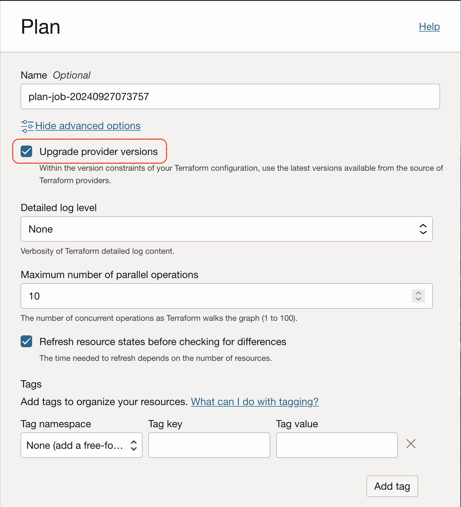

# **OCI LZ Orchestrator Upgrade process**

## **Table of Contents**

[1. Introduction](#1-introduction)</br>
[2. Upgrading configuration](#2-upgrading-configuration)</br>
[3. How to upgrade the configuration with Terraform CLI](#3-how-to-upgrade-the-configuration-with-terraform-cli)</br>
[4. How to upgrade existing OCI Resource Manager stacks](#4-how-to-upgrade-existing-oci-resource-manager-stacks) </br>

&nbsp; 

## **1. Introduction**

The OCI LZ orchestrator is evolving constantly, bringing new capabilities from new core modules functionality or modules. It also includes some great changes to manage dependencies between operations in external locations, as files/object storage buckets, and some other features.

It is our commitment to guide or users in how to upgrade their existing configurations with minimum risk and disruption while moving to the latest versions of the orchestrator to take advantage of all these new cool features.

This document is intended to guide any user with existing configurations of previous versions of the OCI LZ orchestrator to update their configs and orchestrator code. In this way you will be able to keep receiving orchestrator updates that might fix previous bugs and will unlock the capabilities to unlock the management of the services of your interest for the LZ withing the same configuration approach.

We'll differentiate between different versions of the orchestrator. You should be able to update from old versions to the latest ones following the same amount of changes from the older versions to the latest ones.

&nbsp; 


## **2. Upgrading configuration**

## **2.1. Upgrade from versions <2.0.0**

#### **2.1.1. Changes in credentials file**

The argument *home_region* in the *oci-credentials.tfvars.json* has been replaced by the argument *region*. 

Now it is more comprenhensible and also offers the capability to use the region to any secondary region that you want to provision resources to. It doesn't matter if you're provisioning IAM resources also and this is not your home region, as now the orchestrator will detect your OCI home region and will provision the IAM resources there, while the rest of the resources defined in your configuration will be provisioned in the indicated region.

To perform the change, replace in your credentials files (*oci-credentials.tfvars.json*), the *home_region* by *region* and plan/apply with the new orchestrator code. Review carefully the changes to be done in your configuration. It should just be a rename, nothing should be destroyed or recreated.

Summary of the change:

| Variable | New Variable | File |
|---|---|---|
| home_region | region | oci-credentials.tfvars.json |

&nbsp; 

#### **2.1.2. Changes in the IAM Policies Module**

The argument to attach the IAM Policy to a compartment, the *compartment_ocid* has changed for *compartment_id* in the IAM Policies Module.

| Variable | Old Argument | New argument | File |
|---|---|---|---|
| policies_configuration | compartment_ocid | compartment_id | *identity.auto.tfvars.json |

&nbsp; 

#### **2.1.3. General changes referencing compartments with OCIDs/Keys in the networking module**

The networking module has some dependencies in the compartments module. To being able to reference the compartments, we have the possibility to reference the compartments by OCID (**compartment_id*) or by key (**compartment_key*). The reference to keys has been removed and now, the same argument accepts a key created in the same operation, and OCID or and external key.

To perform the change, replace in your network_configuration variable defined in your files (*network.auto.tfvars.json*), the **compartment_key* by **compartment_id* and plan/apply with the new orchestrator code. Review carefully the changes to be done in your configuration. It should just be a rename, nothing should be destroyed or recreated.

Summary of the change:

| Variable | Old Argument | New argument | File |
|---|---|---|---|
| network_configuration | default_compartment_key | default_compartment_id | *network.auto.tfvars.json |
| network_configuration | category_compartment_key | category_compartment_id | *network.auto.tfvars.json |
| network_configuration | compartment_key | compartment_id | *network.auto.tfvars.json |

&nbsp; 

#### **2.1.4. Changes in the security list definition for OSN services.**

The networking module now it is able the region that you're using and simplify the definition of the security list rules to access the regional services. It will apply automatically the correct value without needed to specify the region.

All the egress rules to the all services in the OSN needs to be changed from *all-\<region>-services-in-oracle-services-network* to *all-services* like in this example:

```
 "egress_rules": [
    {
        "description": "egress rule for OSN",
        "dst": "all-fra-services-in-oracle-services-network",
        "dst_type": "SERVICE_CIDR_BLOCK",
        "protocol": "ALL",
        "stateless": false
    }
]
```

To:

```
 "egress_rules": [
    {
        "description": "egress rule for OSN",
        "dst": "all-services",
        "dst_type": "SERVICE_CIDR_BLOCK",
        "protocol": "ALL",
        "stateless": false
    }
]
```

&nbsp; 

## **2.2. Upgrade from versions <=2.0.3**

### **2.2.1. Configuration changes to the OCI Native Firewall policies**

The OCI Native Firewall experienced a major configuration change from the OCI Terraform Provider 5.16.0 version, changing the firewall policies to enable greater services limits in the different types of lists that can be created.

Newer versions of the orchestrator (>2.0.3), adopts the new native firewall policies model and here we will discuss how to upgrade the Terraform configuration with the new model with the minimum service disruption.

***NOTE***: *You've to perform this procedure in all the firewalls manage by the same config file/state file at the same time. There is no other way to do it one-by-one than this if you want to keep the configuration managed with Terraform.*

&nbsp; 

#### **2.2.1.1 Guidelines**

**Upgrade FW policies from the console considerations**

The upgrade process for firewall policies should not normally affect traffic on any firewalls using the policy and typically takes several minutes to complete.

If your network firewall policy upgrade appears to be stuck, there could be a few potential reasons.

Firstly, ensure that the policy you are attempting to upgrade does not contain any of the following attributes, as these may cause issues with the upgrade process:
- An application list with a name longer than ***24 characters***.
- Security or decryption rules where any of the list applications, URLs, sources, or destinations contain more than ***25 elements***.
  
If your policy contains any of the above, you will need to make the necessary changes before attempting the upgrade again.

Additionally, please note that during the upgrade process, you will be unable to make changes to the policy or its components, and once a policy is upgraded, it cannot be downgraded to the old version.

If your pocily gets stuck during upgrade process, you'll need to open a Service Request for getting assistance from Cloud Ops.

&nbsp; 

#### **2.2.1.2 Firewall policies configuration**

As part of the upgrade process you will need to create new configurations for your policies, as the structure has changed significantly.

In the table below you can see how the resources has changed:


<table>
<tr>
<th>Object</th>
<th>Old variable arguments</th>
<th>New variable arguments</th>
</tr>

<tr>
<td>
<b>Common</b>
</td>
<td>

```
compartment_id = optional(string),
defined_tags   = optional(map(string)),
display_name   = optional(string),
freeform_tags  = optional(map(string))
```
</td>
<td>

```
compartment_id = optional(string),
defined_tags   = optional(map(string)),
display_name   = optional(string),
freeform_tags  = optional(map(string)
```

</td>
</tr>
<tr>
<td>
<b>Application/Services Lists</b>
</td>
<td>

```
application_lists = optional(map(object({
    application_list_name = string,
    application_values = map(object({
      type         = string,
      icmp_type    = optional(string),
      icmp_code    = optional(string),
      minimum_port = optional(number),
      maximum_port = optional(number)
    }))
  })))
```
</td>
<td>

```
services = optional(map(object({
  name = string
  type = optional(string) # Valid values: "TCP_SERVICE" or "UDP_SERVICE"
  minimum_port = number
  maximum_port = optional(number)
})))
service_lists = optional(map(object({
  name     = string
  services = list(string)
})))
applications = optional(map(object({
  name      = string,
  type      = string,
  icmp_type = number,
  icmp_code = optional(number),
})))
application_lists = optional(map(object({
  name = string,
  applications = list(string)
})))
```
</td>
</tr>

<tr>
<td>
<b>IP Addresses Lists</b>
</td>
<td>

```
ip_address_lists = optional(map(object({
  ip_address_list_name  = string,
  ip_address_list_value = list(string)
})))
```
</td>
<td>

```
address_lists = optional(map(object({
  name = string,
  type = string, # Valid values: "FQND", "IP"
  addresses = list(string)
})))
```
</td>
</tr>
<tr>
<td>
<b>URL Lists</b>
</td>
<td>

```
url_lists = optional(map(object({
url_list_name = string,
url_list_values = map(object({
  type    = string,
  pattern = string
}))
```
</td>
<td>

```
url_lists = optional(map(object({
  name    = string,
  pattern = string,
  type    = string # Valid value: SIMPLE
})))
```
</td>

</tr>
<td>
<b>Security Rules</b>
</td>
<td>

```
security_rules = optional(map(object({
  action     = string,
  inspection = optional(string),
  name       = string
  conditions = map(object({
    applications = optional(list(string)),
    destinations = optional(list(string)),
    sources      = optional(list(string)),
    urls         = optional(list(string))
  }))
})))
```
</td>
<td>

```
security_rules = optional(map(object({
    action = string, # Valid values: ALLOW,DROP,REJECT,INSPECT
    name   = string,
    application_lists         = optional(list(string)),
    destination_address_lists = optional(list(string)),
    service_lists             = optional(list(string)),
    source_address_lists      = optional(list(string)),
    url_lists                 = optional(list(string)),
    inspection  = optional(string), # This is only applicable if action is INSPECT
    after_rule  = optional(string),
    before_rule = optional(string)
  })))
})))
```
</td>
</tr>
<tr>
<td>
<b>Decryption Profiles</b>
</td>
<td>

```
decryption_profiles = optional(map(object({
  is_out_of_capacity_blocked            = bool,
  is_unsupported_cipher_blocked         = bool,
  is_unsupported_version_blocked        = bool,
  type                                  = string,
  key                                   = string,
  are_certificate_extensions_restricted = optional(bool),
  is_auto_include_alt_name              = optional(bool),
  is_expired_certificate_blocked        = optional(bool),
  is_revocation_status_timeout_blocked  = optional(bool),
  is_unknown_revocation_status_blocked  = optional(bool),
  is_untrusted_issuer_blocked           = optional(bool)
})))
```
</td>
<td>

```
decryption_profiles = optional(map(object({
  type                                  = string, # Valid values: "SSL_FORWARD_PROXY", "SSL_INBOUND_INSPECTION"
  name                                  = string,
  is_out_of_capacity_blocked            = optional(bool),
  is_unsupported_cipher_blocked         = optional(bool),
  is_unsupported_version_blocked        = optional(bool),
  are_certificate_extensions_restricted = optional(bool), # Applicable only when type = "SSL_FORWARD_PROXY"
  is_auto_include_alt_name              = optional(bool), # Applicable only when type = "SSL_FORWARD_PROXY"
  is_expired_certificate_blocked        = optional(bool), # Applicable only when type = "SSL_FORWARD_PROXY"
  is_revocation_status_timeout_blocked  = optional(bool), # Applicable only when type = "SSL_FORWARD_PROXY"
  is_unknown_revocation_status_blocked  = optional(bool), # Applicable only when type = "SSL_FORWARD_PROXY"
  is_untrusted_issuer_blocked           = optional(bool)  # Applicable only when type = "SSL_FORWARD_PROXY"
})))
```
</td>
</tr>
<tr>
<td>
<b>Decryption Rules</b>
</td>
<td>

```
decryption_rules = optional(map(object({
  action             = string,
  name               = string,
  decryption_profile = optional(string),
  secret             = optional(string),
  conditions = map(object({
    destinations = optional(list(string)),
    sources      = optional(list(string))
  }))
})))
```
</td>
<td>

```
decryption_rules = optional(map(object({
  name                        = string,
  action                      = string,
  decryption_profile_id       = optional(string),
  secret                      = optional(string),
  source_ip_address_list      = optional(string),
  destination_ip_address_list = optional(string)
})))
```
</td>
</tr>
<td>
<b>Mapped Secrets</b>
</td>
<td>

```
mapped_secrets = optional(map(object({
  key             = optional(string),
  type            = string,
  vault_secret_id = string,
  version_number  = string,
})))
```
</td>
<td>

```
mapped_secrets = optional(map(object({
  name            = string,
  type            = string, # Valid values: SSL_FORWARD_PROXY, SSL_INBOUND_INSPECTION
  source          = string, # Valid value: OCI_VAULT
  vault_secret_id = string,
  version_number  = string,
})))
```
</td>
</tr>
</table>

Example of ***ORIGINAL*** policy:

```
"NFWPCY-FRA-LZP-HUB-POL1-KEY": {
    "display_name": "nfwpcy-fra-lzp-hub-pol1",
    "application_lists": {
        "NFW-AL-FRA-HUB-1": {
            "application_list_name": "nfw-al-fra-lzp-hub-1",
            "application_values": {
                "NFW-AL-FRA-LZP-HUB-1-1": {
                    "maximum_port": 8080,
                    "minimum_port": 80,
                    "type": "TCP"
                }
            }
        }
    },
    "ip_address_lists": {
        "NFW-IL-FRA-LZP-HUB-1": {
            "ip_address_list_name": "nfw-il-fra-lzp-hub-1",
            "ip_address_list_value": [
                "10.0.8.0/24",
                "10.0.16.0/24"
            ]
        }
    },
    "url_lists": {
        "NFW-UL-FRA-LZP-HUB-1": {
            "url_list_name": "nfw-ul-fra-lzp-hub-1",
            "url_list_values": {
                "NFW-UL-FRA-LZP-HUB-1-1": {
                    "pattern": "testapp1.example.com",
                    "type": "SIMPLE"
                }
            }
        },
        "NFW-UL-FRA-LZP-HUB-2": {
            "url_list_name": "nfw-ul-fra-lzp-hub-2",
            "url_list_values": {
                "NFW-UL-FRA-LZP-HUB-2-1": {
                    "pattern": "pypi.org",
                    "type": "SIMPLE"
                },
                "NFW-UL-FRA-LZP-HUB-2-2": {
                    "pattern": "www.google.com",
                    "type": "SIMPLE"
                },
                "NFW-UL-FRA-LZP-HUB-2-3": {
                    "pattern": "files.pythonhosted.org",
                    "type": "SIMPLE"
                }
            }
        }
    },
    "security_rules": {
        "SECURITY-RULE-INETAPPS": {
            "action": "ALLOW",
            "name": "SecurityRuleIntApps",
            "conditions": {
                "PRD-COND1-A": {
                    "applications": ["nfw-al-fra-lzp-hub-1"],
                    "destinations": [],
                    "sources": [],
                    "urls": []
                }
            }
        },
        "SECURITY-RULE-NAT": {
            "action": "ALLOW",
            "name": "SecurityRuleNAT",
            "conditions": {
                "PRD-COND1-A": {
                    "applications": [],
                    "destinations": [],
                    "sources": ["nfw-il-fra-lzp-hub-1"],
                    "urls": ["nfw-ul-fra-lzp-hub-2"]
                }
            }
        },
        "SECURITY-RULE-INTRUSION": {
            "action": "INSPECT",
            "inspection": "INTRUSION_DETECTION",
            "name": "SecurityRuleIntrusion",
            "conditions": {
                "PRD-COND1-B": {
                    "applications": [
                        "nfw-al-fra-lzp-hub-1"
                    ],
                    "destinations": [],
                    "sources": [
                        "nfw-il-fra-lzp-hub-1"
                    ],
                    "urls": [
                        "nfw-ul-fra-lzp-hub-1"
                    ]
                }
            }
        }
    }
}
```

Example of ***MIGRATED*** policy:

```
"NFWPCY-FRA-LZP-HUB-POL11-KEY": {
    "display_name": "nfwpcy-fra-lzp-hub-pol11",
    "services": {
        "NFW-SV-FRA-LZP-HUB-1-KEY": {
            "name": "nfw-sv-fra-lzp-hub-1",
            "type": "TCP_SERVICE",
            "minimum_port": "80",
            "maximum_port": "8080"
        }
    },
    "service_lists": {
        "NFW-SVL-FRA-LZP-HUB-1-KEY": {
            "name": "nfw-svl-fra-lzp-hub-1",
            "services": ["NFW-SV-FRA-LZP-HUB-1-KEY"]
        }
    },
    "address_lists": {
        "NFW-IL-FRA-LZP-HUB-1-KEY":{
            "name": "nfw-il-fra-lzp-hub-1",
            "type": "IP",
            "addresses": [
                "10.0.8.0/24",
                "10.0.16.0/24"
            ]
        }
    },                                
    "url_lists": {
        "NFW-UL-FRA-LZP-HUB-1-KEY": {
            "name": "nfw-ul-fra-lzp-hub-1",
            "type": "SIMPLE",
            "pattern": "testapp1.example.com"
        },
        "NFW-UL-FRA-LZP-HUB-2-KEY": {
            "name": "nfw-ul-fra-lzp-hub-2",
            "type": "SIMPLE",
            "pattern": "www.google.com"
        }
    },                                    
    "security_rules": {
        "SECURITY-RULE-INETAPPS-KEY": {
            "action": "ALLOW",
            "name": "SecurityRuleIntApps",
            "service_list": ["NFW-SVL-FRA-LZP-HUB-1-KEY"]
        },
        "SECURITY-RULE-INTRUSION-KEY": {
            "action": "INSPECT",
            "inspection": "INTRUSION_DETECTION",
            "name": "SecurityRuleIntrusion",
            "service_lists": ["NFW-SVL-FRA-LZP-HUB-1-KEY"],
            "source_address_lists": ["NFW-IL-FRA-LZP-HUB-1-KEY"],
            "url_lists": ["NFW-UL-FRA-LZP-HUB-1-KEY"],
            "after_rule": "SecurityRuleIntApps"
        },
        "SECURITY-RULE-NAT-KEY": {
            "action": "ALLOW",
            "name": "SecurityRuleNAT",
            "source_address_lists": ["NFW-IL-FRA-LZP-HUB-1-KEY"],
            "url_lists": ["NFW-UL-FRA-LZP-HUB-2-KEY"],
            "after_rule": "SecurityRuleIntrusion"
        }
    }
}
```

&nbsp; 

#### **2.2.1.3 Upgrade procedure**

The procedure is the following:

  1. Upgrade Terraform binary version from 1.2.9 to 1.5.7. You can download it for your platform from [here](https://developer.hashicorp.com/terraform/install). Ensure that you setup the new terraform binary in your profile instead of the old one.
   
  2. Upgrade the orchestrator by cloning the latest version of this repo in your Terraform machine.
   
  3. Upgrade the FW active policy from the console: 
     1. Identify the FW(s) active policy: *Menu -> Identity & Security -> Firewalls -> Choose FW from compartment -> Identify the Network firewall policy*
     2. Upgrade the FW(s) active policy: *Menu -> Identity & Security -> Firewalls -> Network firewall policies -> Choose FW policy from compartment -> Upgrade policy*
   
  4. Create new policies configuration following the suggested guidelines.
   
  5. Point the NFW config to the new upgraded policy OCID:
    <br>
      a. Replace: 
      *"network_firewall_policy_key"*
    <br>
      b. With:
      *"network_firewall_policy_id"* *:"\<OCID of the new upgraded active policy from the console>"*

  6. Ensure you've a backup of the terraform state file (just in case you damage the current state file in the next step).
   
  7. Remove old policies from the state file. E.g.: Removing 2 FW policies identified with the keys *NFWPCY-FRA-LZP-HUB-POL1-KEY* and *NFWPCY-FRA-LZP-HUB-POL2-KEY*:
  ```  
    $ terraform state rm 'module.oci_lz_network[0].oci_network_firewall_network_firewall_policy.these["NFWPCY-FRA-LZP-HUB-POL1-KEY"]'
    Removed module.oci_lz_network[0].oci_network_firewall_network_firewall_policy.these["NFWPCY-FRA-LZP-HUB-POL1-KEY"]
    Successfully removed 1 resource instance(s).
    
    $ terraform state rm 'module.oci_lz_network[0].oci_network_firewall_network_firewall_policy.these["NFWPCY-FRA-LZP-HUB-POL2-KEY"]'
    Removed module.oci_lz_network[0].oci_network_firewall_network_firewall_policy.these["NFWPCY-FRA-LZP-HUB-POL2-KEY"]
    Successfully removed 1 resource instance(s).
  ```  

  8. Run the plan, review that none resource is going to be deleted.
  - You should see updates in-place for the different networking resources updating the freeform tag with the networking module use.
  - You should see update in-place for the firewall changing the active policy.
  - You should see the different resources to be created for the new policies.
 
  9. If you're ok with the plan run the apply to provision new policies and replace the active policy in the FW.
   
  10. Edit again the configuration and replace in the FW the policy:
    <br>
      a. Replace: 
      *"network_firewall_policy_id"*
    <br>
      b. With the policy key you want to be active from the created and managed ones:
      *"network_firewall_policy_key"*

  11. Remove from the console the policies you deleted from the state file and the upgraded from the console.

&nbsp; 

## **2.3. Modules renaming**

The Terraform core modules used by the new orchestrator (>v2.0) has changed their names with a common name convention. However, a mechanisism has been introduced in the code to rename in the terraform state file the resources created with the old orchestrator with the new names.

You might see the first time you run the new orchestrator some messages indicating that one module is going to be renamed with a new name in an update-in-place operation. Don't be scared with that as it is expected.

Here you have a list with the old module name and the new one:

| Old module name | New module name |
|---|---|
| cislz_compartments | oci_lz_compartments |
| cislz_groups | oci_lz_groups |
| cislz_dynamic_groups | oci_lz_dynamic_groups |
| cislz_policies | oci_lz_policies |
| terraform-oci-cis-landing-zone-network | oci_lz_network |

The kind of messages expected to see in the plan/apply are like these:

```
  # module.terraform-oci-open-lz.module.terraform-oci-cis-landing-zone-network.module.l7_load_balancers.oci_load_balancer_backend.these["SHARED-LB-BCK-END-SET-01-BE-01""] has moved to module.oci_lz_orchestrator.module.oci_lz_network[0].module.l7_load_balancers.oci_load_balancer_backend.these[""SHARED-LB-BCK-END-SET-01-BE-01"]
    (...)
```

&nbsp; 

## **3. How to upgrade the configuration with Terraform CLI**

Once you've updated your JSON configuration files, you need to update the configuration in your state file.

Clone the new version of the repository, initialize the configuration to download the dependent Terraform core modules and you're ready to run your plan/apply.

To clone the repository do:

```
git clone git@github.com:oci-landing-zones/terraform-oci-modules-orchestrator.git
```

Cloning the latest version:
```
git clone git@github.com:oci-landing-zones/terraform-oci-modules-orchestrator.git
```

For referring to a specific module version, append *ref=\<version\>* to the *source* attribute value. 

E.g.: 
```
git clone git@github.com:oci-landing-zones/terraform-oci-modules-orchestrator.git?ref=v2.0.0
```

Initialize:

```terraform init```

Run ```terraform plan``` with the IAM and Network configuration.

```
terraform plan \
-var-file ../examples/oci-open-lz/op01_manage_shared_services/oci-credentials.tfvars.json \
-var-file ../examples/oci-open-lz/op01_manage_shared_services/open_lz_shared_identity.auto.tfvars.json \
-var-file ../examples/oci-open-lz/op01_manage_shared_services/open_lz_shared_network.auto.tfvars.json \
-state ../examples/oci-open-lz/op01_manage_shared_services/terraform.tfstate
```

***NOTE: Pay attention to the plan output to check that none resources are going to be destroyed and re-created, as it should not.***

Run ```terraform apply``` with the IAM and Network configuration.

```
terraform apply \
-var-file <location to your credentials file>/oci-credentials.tfvars.json \
-var-file <location to your identity JSON file>/<identity>.auto.tfvars.json \
-var-file <location to your identity JSON file>/<network>.auto.tfvars.json \
-state <location to your identity JSON file>/terraform.tfstate
```

&nbsp; 

## **4. How to upgrade existing OCI Resource Manager stacks**

There a couple of strategies to upgrade your existing OCI Resource Manager stacks:

1. **In-place upgrade**. The stack configuration is edited and the code is replaced with the new version. The configuration is updated in the external location. State file remains in the stack. 
   
2. **Out-of-place upgrade**. A new stack is created with the new orchestrator code. The configuration can be pointed to the same old location or a new one. You need to download the Terraform state file from the orinal stack and upload into the new one.

We'll just document here the in-place approach and all the steps indicated are executed in the OCI Console.

&nbsp; 

### **4.1. ORM stack in-place upgrade**

#### **4.1.1. Backup**

This step is optional, but we encorage to you to do it just in case that an error arise during the upgrade and you need to restore part of the configuration, always that you haven't recreated some resources that might make the backup unusable.

Here you have the details to backup the different elements:

1. **Backup the Terraform code**. On your operation stack, locate the *Terraform configuration* and click on *Download*, save in a folder in your computer.
   
2. **Backup the Terraform state file**. On your operation stack, click on the *More actions* button and click on the *Download Terraform state*, save in a folder in your computer.
   
3. **Backup the Terraform configuration files**. On your operation stack, click on *Variables*, located in the left *Resources* pane. Check the variable called *input_config_files_urls* and access the HCL, JSON or YAML files for your Identity and/or Network configuration from your browser. These files can be located in different places based on your setup (public git repository, Object Storage or others). Save in a folder in your computer.

&nbsp; 

#### **4.1.2. Edit the ORM stack configuration**

To update the configuration, follow these steps:

1. **Download the new orchestrator**. Access [this](https://github.com/oci-landing-zones/terraform-oci-modules-orchestrator/archive/refs/heads/main.zip) link and download in the new repository contents in your computer.
   
2. **Edit the stack**. On your stack, click on the *Edit* button and click on *Edit stack*. 
   * ***Stack information section***:
     * Drop the zip file that you've just downloaded in the *Drop a .zip file* rectangle.
     * In the *Working directory*, select the *terraform-oci-landing-zones-orchestrator-main/rms-facade*.
     * In the *Terraform version* dropdown list, select:
       * For versions of the orchestrator **less or equal 2.0.3** select the **"1.2.x"** version. Confirm clicking in *Yes* button the Terraform version change dialog box when appears. 
       * For versions of the orchestrator **greater than 2.0.3** select the **"1.5.x"** version. Confirm clicking in *Yes* button the Terraform version change dialog box when appears.
       * This step should look like this:
    
     * Click *Next*.
   * ***Configure variables section***:
     * **Region**. Check that the region is the same as where you have the resources for this stack (might be different to where the stacks belongs.).
     * **Configuration source**. Select the source for your configuration files. If you were using before a public git repo or a public or pre-authenticated OCI Object Storage bucket, select *url*. Now you have the option to use private GitHub repos or private buckets. If you're planning to change to one of these repositories for your configuration, we recommend to do it in a second phase after everything is working fine with the new code to reduced the risks in the process.
     * **URL Sources**. Check that the URL Sources are correct for your existing configuration.
     * **Dependency Files**. The feature is new and optional. It is used to store a JSON files with the keys and OCIDs of some resources created in a previous operation (stack) so they can be used in this operation (stack). As with the configuration sources, we encorage to start using this feature after the upgrade of the previous orchestrator version. This step should look like this:
    
     * Click *Next*.
   * ***Review section***:
     * Just review that the stack information and the variables are correct, ensure that the *Run apply* is unmatched. This step should look like this:
    
     * Click *Next*.

3. **Update the configuration files**. Ensure that you followed the section [2. Upgrading configuration](#2-upgrading-configuration) in this document and you uploaded the updated configuration files in the location configured in the stack (GitHub, OSS, other.).
   
4. **Run the plan**. Just click on the *Plan* button in the stack.
   * ***For versions of the orchestrator greater than 2.0.3***, click on the *"Show advanced options"* and check the *Upgrade provider versions*, like show below:
    
   * Click *Plan* and ***Pay LOT of attention to the output of the plan***. You should just see some changes in some freeform_tags that are being introduced with the version of the Terraform code module used (not any destruction/creation of resources). You also would be able to see the modules renaming mentioned in the section 2.4.

5. **Run the apply**. Just click on the *Apply* button in the stack. You should just see some changes in some freeform_tags that are being introduced with the version of the Terraform code module used (not any destruction/creation of resources). Modify any other stack/operation using old orchestrator version, to have full coherence in your infrastructure.