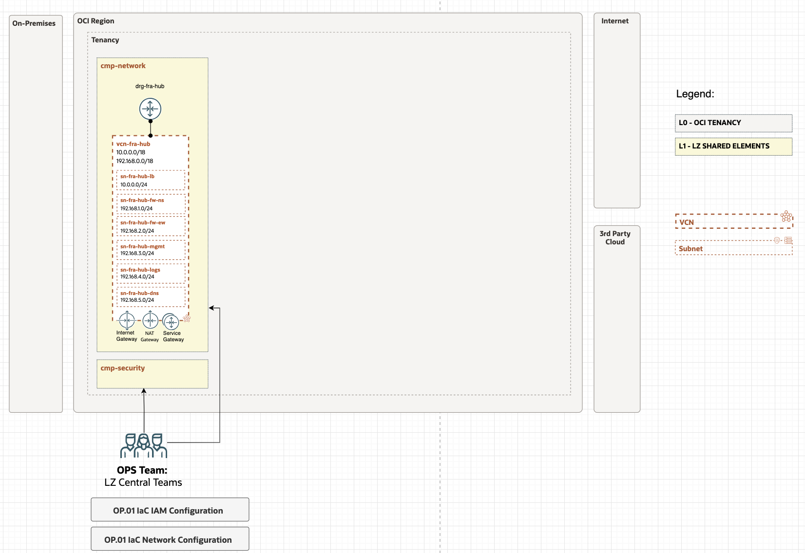
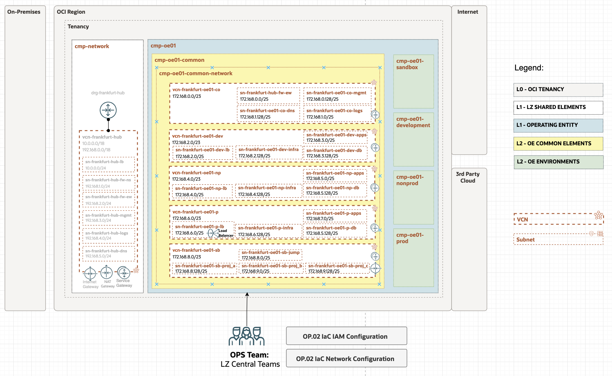
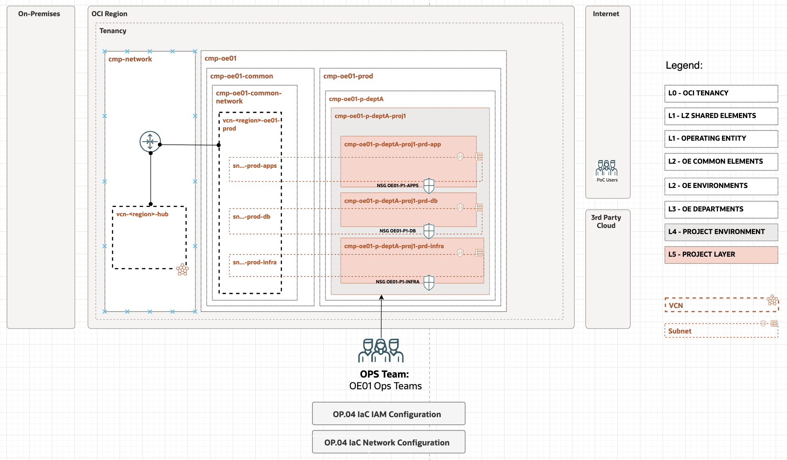

# OCI Operating Entities Landing Zone

The **OCI Operating Entities Landing Zone** is a model of Standard Landing Zone designed for organizations who wants to run OCI workloads with fine-grained segregation of duties, strong isolation of resources, and with an scalable operating model.

An *Operating Entity* can be any Line of Business, Business Unit, Operating Company, Division, etc., that may operate indepedently from the rest of the organization, with its particular security requirements and operational teams. 

You can use this **[OCI Operating Entities Landing Zone Blueprint](https://github.com/oracle-quickstart/terraform-oci-open-lz)** designed and documented with a **repeatable design process**. It presents an end-to-end coherent solution &ndash; with the security, network, and operations views &ndash; of what an organization-wide landing zone looks like.

The **benefit** of this blueprint is that it can be completely **adjusted and easily simplified** into any other type of landing zone, by following the design steps towards your needs.  Using this reference blueprint will help **create a day-two operational model ready to scale**.

You can use the [**OCI Operating Entities Landing Zone example**](https://github.com/oracle-quickstart/terraform-oci-open-lz/tree/master/examples/oci-open-lz), to **configure** the resources with *JSON/YAML* configurations instead of coding them, and adjusting to your needs (CIDR ranges, routing, FW rules, etc.), so you'll avoid to start from scratch.

The **benefits** of using this approach are: 
- **Focus on Value**: Focus on configuring the design and resources, instead of coding them. This means shorter time-to-value, lower effort, and lower risk.
- **Best Practices**: Use existing top-quality Terraform modules that are open and full of best practices. It's possible to leverage this to evolve OCI Terraform skills and apply future IaC best practices. This also means lower risk and lower efforts.
- **Scale Day Two**: Being able to split operational configurations from code it's a game change in cloud operations, and will simplify drastically the day-two operations, opening the path for a **GitOps** operating model and potentially simpler automation. The cloud operators will only work with configurations, not code.

You can use the orchestrator with Terraform CLI or OCI Resource Manager to deploy the operations explained in the Blueprint. Each operation can be run by a different team within the organization, stored in different repositories and with an independent Terraform State File, spliting the risk and blast radius of operational failure.

Some example diagrams of what will be deployed are the following:

**Operation 1: Manage Shared Services**

**Operation 2: Manage Operating Entities**

**Operation 4: Manage Project**

